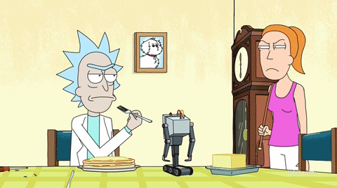

# Automatic Control (AC)

  

## Getting started

Here some meta-information about this repository:
- **Course**: `06LSLOA` - Automatic Control
- **Teacher**: Massimo Canale
- **Academic Year**: 2020/2021
- **CFU**: 10
- **Author of the notes**: Davide Arcolini
- **Reviewed by**: -
