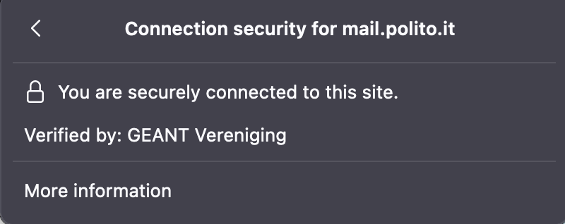
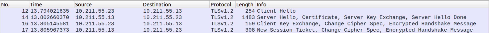
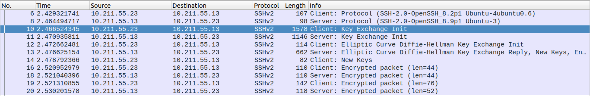
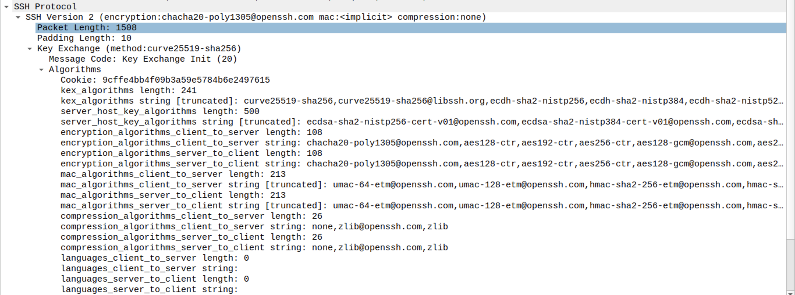
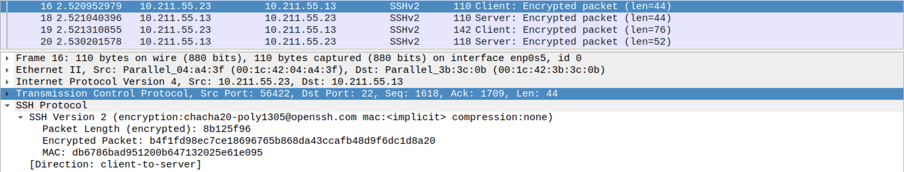
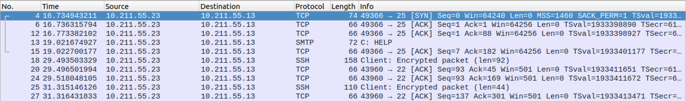

# LAB 01 - TLS and SSH

1. [Introduction](#introduction)
2. [TLS](#transport-layer-security-tls)
    1. [Configuring a TLS Server](#configuring-a-tls-server)
    2. [TLS 1.2](#analyzing-the-tls-12-handshake-messages)
    3. [TLS 1.3](#analysing-the-tls-13-handshake-messages)
    4. [Client Authentication](#client-authentication-in-tls)
    5. [TLS in Apache Web Server](#enabling-tls-in-apache-web-server)
3. [SSH](#secure-shell-ssh)
    1. [Password access](#connecting-through-a-secure-channel)
    2. [Passwordless access](#password-less-access)
    3. [Tunneling](#tunneling)

## Introduction

The laboratory is composed of two parts: **TLS** and **SSH**. In the first part we will have to manage a TLS connection between a server and a client, configuring authentication parameters and sniffing traffic between the two machines in order to understand the procedures,

## Transport Layer Security (TLS)
Before starting with the laboratory, let's take a closer look to TLS.

**Transport Layer Security** (**TLS**) is a cryptographic protocol that provides secure communication over a computer network. It is used to establish an encrypted connection between two parties, typically a client and a server. TLS works by establishing a secure connection between two parties using a combination of public and private keys, as well as a set of algorithms for encryption and authentication. When a client wants to establish a secure connection with a server, the client sends a message to the server requesting a secure connection. The server responds by sending its public key and a message called `server hello`. The client then generates a random number, called a `pre-master secret`, and encrypts it using the server's public key. The encrypted pre-master secret is sent back to the server, which decrypts it using its private key. Both the client and server then use the pre-master secret to generate a shared secret that is used to encrypt and decrypt messages exchanged over the secure connection.

TLS provides four security features:
1. **Peer authentication**: mandatory for the server and optional for the client.
2. **Message confidentiality**: data can be optionally encrypted.
3. **Message integrity and authentication**: it completes message CIA.
4. **Replay protection**: with nonces and sequence numbers (remember, it is on top of TCP).


### Setting up a TLS channel
First request of the laboratory is to connect to a generic web server (e.g. the web portal of Politecnico di Torino) and evaluate the TLS connection established with the browser. Click on the lock and see the certificate.

<p align="center">
    
</p>

- Which TLS version was used in the TLS connection to the above server? \
`1.3`
- Which fields are used for the identification of the server? \
In the `Subject name` of the Server certificate, the `common name` is used to identify the server.
- Which is the certification path? \
`USERTrust RSA Certification Authority` - `GEANT OV RSA CA 4` - `mail.polito.it`
- Which algorithms have been negotiated and used for protecting the data transferred? \
`AES_256`

### Configuring a TLS server
Getting to the real work here, we need to configure a TLS server in order to sniff the ingoing and outgoing traffic. First things first, we need a signed certificate and since we are that cool kids, we are going to also create our personal **Certification Authority** (**CA**). It may seems complicated to be performed, but actually it is a trivial procedure! It can be done with a **perl script** already present in Kali Linux which allows us to create a new CA able to signed certificates for us. The script can be found at `/usr/lib/ssl/misc/CA.pl` and it accepts the option `-newca`. The command is the following:
```perl
/usr/lib/ssl/misc/CA.pl -newca
```

After executing the script, we will be prompted to insert a lot of information: 
- a **PEM passphrase**: this is the password that will be used to protect the private key of the CA.
- **Country Name** (2 letter code): the two-letter ISO code for the country where your organization is located.
- **State or Province Name** (full name): province, region, county or state. This should not be abbreviated.
- **Locality Name** (eg, city): town, city, village, etc. name 
- **Organization Name** (eg, company): usually the legal name of a company or entity and should include any suffixes such as Ltd., Inc., or Corp. 
- **Organizational Unit Name** (eg, section): internal organization department/division name. Like a website maybe.
- **Common Name** (e.g. server FQDN or YOUR name): this is fully qualified domain name that you wish to secure. This must be unique!
- **Email Address**: guess what?


> At the end of the process, we will have created our personal CA able to sign certificates.

Now we need to configure the TLS server. In order to do, we will need to create an RSA private key, create a CSR and ask the CA to sign the CSR and issues a valid server certificate.
 The procedure (from scratch is the following):
1. Generate a **Certificate Signing Request (CSR)**. Use the `-newkey` options to generate the private key required. A Certificate Signing Request is a message sent from an applicant to a certificate authority of the public key infrastructure in order to apply for a digital identity certificate. It usually contains the public key for which the certificate should be issued, identifying information (such as a domain name) and a proof of authenticity including integrity protection (e.g., a digital signature). It can be created with the following command:
```perl
openssl req -new -x509 -days 365 -newkey rsa:2048 -keyout server_privatekey.pem -out server_creq.csr
```

2. Sign the certificate with the private key of the CA (default, the command will look into the `demoCA` folder previously created by the openssl command):
```perl
openssl ca -in server_creq.pem -out server_cert.pem -policy policy_anything -days 365
```

Finally, we have our server certificate signed by a CA and ready to be used!

### Analyzing the TLS 1.2 handshake messages
Now we need to start the TLS server. We can do it with the `openssl` command:
```perl
openssl s_server -www -key server_privatekey.pem -cert server_cert.pem
```

We can start sniff the network with **Wireshark** and connect with a client to see the result. 
The command to connect with a client is the following: 
```perl
openssl s_client -connect <server_IP>:4433 -state -showcerts -CAfile cacert.pem -tls1_2
```
where `cacert.pem` is the certificate of the root authority that signed the server certificate.

The sniffed traffic of our interest is the following:
<p align="center">
    
</p>

#### Questions: 
1. *How many RTTs do you see?* \
2 RTTs. One for `Client Hello` and `Server Hello` to `Server Hello Done`. Another for `Client Key Exchange` and `Finished` from server.

2. *Which TLS handshake messages are exchanged?* 
    - `Client Hello`;
    - `Server Hello`, `Certificate` and `Server Key Exchange`;
    - `Client Key Exchange`, `Change Cipher Spec` and `Encrypted Handshake Message` (i.e., what in the slides of the course has been called the `Finished` message);
    - `Change Cipher Spec` and `Encrypted Handshake Message` (this time coming from the server).

3. *Which ciphersuite has been negotiated?* \
In this case: `Cipher Suite: TLS_ECDHE_RSA_WITH_AES_256_GCM_SHA384 (0xc030)`

4. *Does it provide forward secrecy (if yes, explain briefly why in the following box)?* \
Yes! Because the cipher suite used implemented **ECDHE** which uses Ephemeral keys to provide forward secrecy.

5. *What do you see in the “Extensions” of the Client Hello message?* \
A list of available extensions like the supported group for the ECDH exchange.

5. *What is the purpose of the “New Session Ticket”?* \
If the client possesses a ticket that it wants to use to resume a session, then it includes the ticket in the SessionTicket extension in the ClientHello.  If the client does not have a ticket and is prepared to receive one in the NewSessionTicket handshake message, then it MUST include a zero-length ticket in the SessionTicket extension. If the client is not prepared to receive a ticket in the NewSessionTicket handshake message, then it MUST NOT include a SessionTicket extension unless it is sending a non-empty ticket it received through some other means from the server.

6. *What is the “Encrypted Handshake Message” and which is its purpose?* \
It is the finished message (that we can see as *Encrypted Handshake Message* because unlike the previous messages, this message has been encrypted with the just negotiated keys/algorithms). Its purpose is to indicates that the TLS negotiation is completed for the client.

### Client requests to re-use session-id
Client may ask server to re-enable a session already authorized. If the `session-id` value in the `Server Hello` message is not equal to zero, the client is asking to reuse the specified session-id. With openssl, it is possible to use the following command to start a new TLS session and open 6 connections in a row:
```perl
openssl s_client -connect <server_IP>:4433 -state -CAfile cecert.pem -tls1_2 -reconnect
```

### Analysing the TLS 1.3 handshake messages
Enabling TLS v1.3 allows the handshake to be performed with fewer messages. Server starts sending application data as soon as possible, after `Server Hello` message.

#### Questions: 
1. *How many RTTs do you see?* \
1 RTT. This time the connection is faster and server can start sending application data after `Server Hello`.

3. *Which ciphersuite has been negotiated?* \
In this case: `Cipher Suite: TLS_AES_256_GCM_SHA384 (0x1302)`

### Client authentication in TLS
Now we need to repeat the same process we have done server-side, but for the client. So, create a new CA authority, request a new certificate for the client and issue the certificate. We are ready to go now.

Configure now the server so that to request client authentication during the handshake phase of the TLS protocol:
```perl
openssl s_server -www -key server_privatekey.pem -cert server_cert.pem -CAfile cacert_client.pem -Verify 0
```

where `cacert_client.pem` is the root CA certificate that signed the client certificate.

Now we can connect with the client using the command: 
```perl
openssl s_client -connect 10.211.55.18:4433 -state -CAfile cacert_server.pem -cert client_cert.pem -key client_privatekey.pem -tls1_2
```

where `cacert_server.pem` is the root CA certificate that signed the server certificate.

#### Questions:
1. *Which messages changed?* \
Now we have a certificate request from the server, asking the client to authenticate itself. Client, on the other hand, responds with the certificate we have generate earlier.

2. *In which TLS handshake message is placed the information about the CA accepted by the server (for the client certificates)?* \
It is the `Certificate Verify`, which contains the signature performed over all the messages sent up to this point. 

### Enabling TLS in Apache Web Server
Everything's cool up to this point, but let's move to the next step. We are now asked to set up an HTTP Apache Web Server. To do so, we can use the certificates issued by Politecnico for this laboratory, but they will probably be expired. Therefore, we are going to use the certificates created previously. 

But let's proceed step by step.

-  In the **client machine**, we need to configure the local DNS to be able to find the website online (it will be on our LAN). Let's add the IP-name relation in the `/etc/hosts` file. Remember to perform this task as a sudo user!
```perl
# LAB01 - DNS
10.211.55.18    www.mywebsite.com
```

- In the **server machine**, we need to set up the Apache server. To do so, we will use the `default-ssl.conf` provided by the laboratory supports and we will follow the guide on the PDF. Everything should work as expected.

Now we can start the Apache Web Server with the `systemctl` utility: 
```perl
sudo systemctl start apache2
```

We can now connect to the website from our client browser by navigating to `https://www.mywebsite.com`.

#### Enabling client authentication
- In the **server machine**, we need to enable the client authentication by modifying the configuration file for the apache2 web server (`/etc/apache2/sites-enabled/default-ssl.conf`)

- In the **client machine**, we need to import the **PKCS#12** file client_cert.p12 to the web browser, in order to authenticate the client. 
We can do it with the command:
```perl
openssl pkcs12 -export -in client_cert.pem -inkey client_pkey.pem -name client_certificate -certfile demoCA/cacert.pem -out client_cert.p12
```
After importing the certificate, we should be able to authenticate ourselves as clients.

#### Certificates Revocation List
In this part of the exercise, we will see how to enable certificate revocation checking CRL in the Apache Web Server.

Following the guide on the PDF: 
1. revoke the certificate with the command:
```perl
openssl ca -revoke demoCA/newcerts/<cert_serial_number.pem>
```
2. issue the CRL:
```perl
openssl ca -gencrl -out mycrl.pem
```


## Secure Shell (SSH)
Second part of the laboratory: work with SSH.

**SSH** (**Secure Shell**) is a network protocol that is used to secure the connection between a client and a server. It provides a secure channel over an unsecured network, allowing data to be transmitted privately and without the possibility of being intercepted or altered by an attacker.

SSH is commonly used to access servers remotely, to run commands on a remote server, and to transfer files between systems. It is widely used in corporate environments, academia, and government agencies to secure network communications and to provide secure remote access to servers and other resources.

SSH uses public key cryptography and a variety of encryption algorithms to secure the connection between the client and server. It also provides authentication capabilities to verify the identity of the client and the server.

### Connecting through a secure channel
Now we need to set up a secure channel for Bob and Alice in order to let them communicate. SSH is a protocol based on **asymmetric cryptography**, which is a secure replacement for other protocols used in the past to remote connect two machines in the wild (like `telnet` or `rlogin`).

The purpose of this first part is to grant Alice an access to Bob's machine. The task to be performed are the following:
1. On Bob's machine: add a new user `Alice` with the command `adduser alice` and set up the SSH server with the `sudo systemctl start ssh` command.

2. On Alice's machine: ask Bob for his **host-key sha256 fingerprint** (that must be equal to the one released by Bob OOB, e.g. in a physical meeting or in a private chat):
```bash
ssh -o FingerprintHash=sha256 <Bob_IP>
```

If everything is working fine, now Alice can store it permanently in her file system and she will be granted access to Bob's machine by using the password declared previously.

When the previous operations are performed, the result traffic captured in Wireshark is the following:

<p align="center">
    
</p>

Where it is possible to see the content of the `SSH_MSG_HEXINIT` packet: 

<p align="center">
    
</p>

containing the 16-bytes random cookie and all the other related stuff.

Moreover, here's an example of the **SSH Binary Packet Protocol** encrypted, which is exchanged after the previous initial setup, containing:
- the `packet_length`;
- the encrypted packet itself, containing:
    - the `padding_length`;
    - the `payload` itself (maybe compressed);
    - the `random_padding`;
- the integrity `MAC` value.

<p align="center">
    
</p>


### Passwordless access
We are going to repeat the same scenario (Alice wants to run a command shell on the Bob machine) but removing the need to send to Bob a password to authenticate. This will be substituted by using the Alice private key for authentication.

First things first, Alice needs a keypair. It can be generated through the command:
```bash
ssh-keygen -t rsa
```
whose output is the following (very explicative): 
```bash
Generating public/private rsa key pair.
Enter file in which to save the key (/home/parallels/.ssh/id_rsa): 
Enter passphrase (empty for no passphrase): 
Enter same passphrase again: 
Your identification has been saved in /home/parallels/.ssh/id_rsa
Your public key has been saved in /home/parallels/.ssh/id_rsa.pub
The key fingerprint is:
SHA256:0U1cA+Tk43ashwO1K1XPvoTQOyblRO6gnaKpouo40C8 parallels@kali-linux-2022-2
The key's randomart image is:
+---[RSA 3072]----+
|           o=oo  |
|         . *.  . |
|        . . *..  |
|         . o+= o |
| .      S .o==o o|
|. .       o+O=o. |
|.  .     o.+=B...|
|o E..   o ..ooo .|
|=+.....o       . |
+----[SHA256]-----+

```

Now, the keypair is stored in `$HOME/.ssh/`, where a bunch of file can be found:
- `id_rsa`: contains the private key of Alice;
- `is_rsa.pub`: contains the public key of Alice;
- `known_hosts`: contains the list of machines that Alice is able to authenticate to.
- `known_hosts.old`: contains the previous version list of machines that Alice was able to authenticate to.

Next step to be performed is to copy Alice's public key on Bob's machine and stores it in `$HOME/.ssh/authorized_keys`. It can be done in a bunch of different ways (e.g., through `ssh` protocol itself, or with a TLS connection like we did in the first part). However, we can exploit the `openSSH` utility `ssh-copy-id` which copies the public key and stores it in the appropriate place in just one command: 
```bash
ssh-copy-id <Bob_IP>
```

#### Questions
1. *Why passwordless access improves overall security?*
    - **Reduces the risk of password-based attacks**: by eliminating the need for passwords, passwordless access reduces the risk of password-based attacks, such as dictionary attacks and brute force attacks, which try to guess or crack passwords.
    - **Increases the strength of authentication**: passwordless methods, such as public key authentication, can be more secure than passwords because they are typically based on cryptographic keys, which are much harder to guess or crack than passwords.
    - **Simplifies the user experience**: passwordless access can simplify the user experience by eliminating the need for users to remember and enter passwords. This can reduce the risk of password-related issues, such as forgotten passwords or users writing down passwords, which can compromise security.
    - **Improves security in shared environments**: in shared environments, such as shared servers or cloud environments, passwordless access can help to prevent unauthorized access by eliminating the need for users to share passwords.

2. *Do you know any remaining issue for this kind of configuration?*
    - **Lost or compromised keys**: if a user's key is lost or compromised, it can be difficult to regain access to the system. This can be a problem if the user does not have a backup key or if the user does not have access to a recovery mechanism, such as a recovery code. 
    - **Key management**: managing keys can be complex, especially in large organizations with many users. It can be difficult to keep track of who has access to which systems, and revoking access can be time-consuming if keys are not managed properly.
    - **Limited support**: not all systems and applications support passwordless authentication methods. Some systems may only support password-based authentication, which can make it difficult to implement passwordless access in those environments.
    - **Increased complexity**: implementing passwordless access can be more complex than using password-based authentication, especially for users who are not familiar with key-based authentication. This can be a barrier to adoption for some users.

### Tunneling
SSH provides different forms of tunneling, i.e. direct, local, and remote, to transport higher-layer protocols inside a secure channel. SSH tunneling enables adding network security to legacy applications that do not natively support encryption.

#### Direct tunneling

**Direct tunneling** allows the client machine to run the graphical X11 protocols through a  SSH secure channel. Alice can use the command `ssh -X alice@<Bob_IP>` to connect with a graphical session to the Bob's machine.

Afterwards, it can run the command `firefox` and the graphical web browser interface will appear on Alice's machine.

#### Local Port Forwarding

**Local Port Forwarding**, or **Local Tunneling** allows a client machine to forwards data to the destination through an SSH secure channel. Alice can use the command `ssh -L localhost:1234:<Bob_IP>:25 alice@<Bob_IP>` to enable port forwarding from port 1234 to port 25 in a SSH secure channel. Then, Alice can connect with an insecure protocol (like `telnet localhost 1234`) to the destination machine. All the traffic will be encapsulated in the SSH tunnel and no Wireshark would be able to decrypt the meaning of the commands run with `telnet`. 

What is happening is the following:
- the command `ssh -L localhost:1234:<Bob_IP>:25 alice@<Bob_IP>` will open a new shell on Alice's machine, hosting the encrypted SSH secure tunnel to Bob's machine.
- Alice's now has two ways to `telnet` Bob's machine:
    1. Insecure `telnet` direct connection by running (on another shell, not the one having the connection to Bob's machine) the command: `telnet <Bob_IP> 25`
    2. Secure `telnet` SSH tunneled by running (on another shell, not the one having the connection to Bob's machine) the command: `telnet localhost 1234`

In the second case, Alice will perform a connection to its own machine (at port `1234`) which is hosting the `Local Port Forwarding` SSH service. Bob (or anyone sniffing) will not be able to see that second kind of traffic, with respect to the first case where the `HELP` command run on `telnet` has been sent in clear!

<p align="center">
    
</p>


#### Remote Port Forwarding

**Remote Port Forwarding**, also called **Reverse Tunneling**, redirects the remote server's port to the localhost's port. When remote port forwarding is used, at first, the client connects to the server with SSH. Then, SSH creates a separate tunnel inside the existing SSH session that redirects incoming traffic in the remote port to localhost (where SSH connection was created). In Bob's machine, we need to run the command: `ssh -R 8000:<Bob_IP>:80 bob@<Bob_IP>` which will redirect the incoming traffic on port 80 to the localhost port 8000. 
