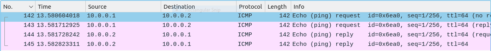
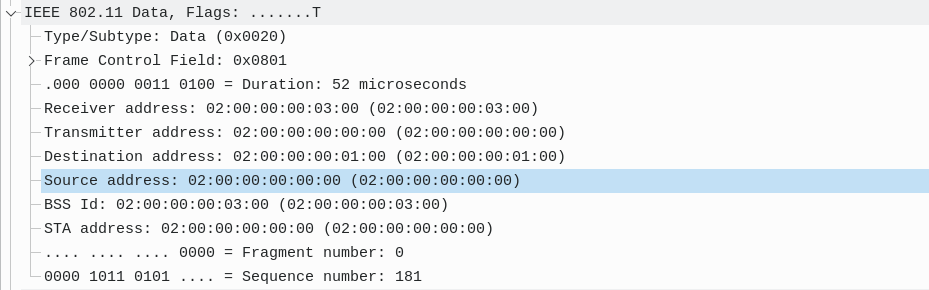
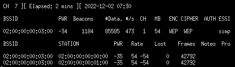
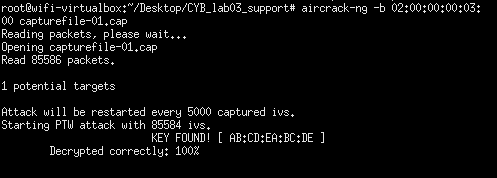
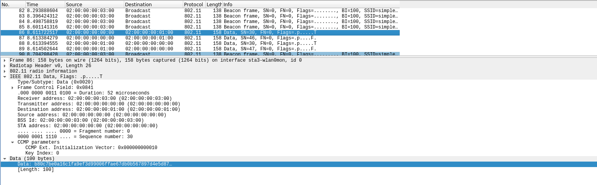

# LAB 03 - Wireless Security

1. [Introduction](#introduction)
2. [Mininet-Wifi](#mininet-wifi)
    1. [Experiment with a simple wireless topology](#experiment-with-a-simple-wireless-topology)
    2. [Sniffing on a Wireless network](#sniffing-on-a-wireless-network)
    3. [Exploiting WEP connections](#exploiting-wep-connections)
        1. [IV Collision Attacks](#iv-collision-attacks)
    4. [Exploiting WPA2 Connections](#exploiting-wpa2-connections)
        1. [WPA Attacks](#wpa-attacks)

## Introduction
In this laboratory, we will perform exercises aimed to experiment with wireless networks tools to understand in more detail their working principles.

Here's a list of **tools** used in this laboratory:
- **Wireshark**: open-source tool(having a user-friendly graphical interface) which allows capturing network traffic.
- `iw` a command-line program to get and set wireless network card parameters (like, for example, the network SSID). Its purpose is somehow similar to the `ifconfig` command for the wireless case.
- **Aircrack-ng suite** a set of open-source command-line tools to monitor, attack, test and crack 802.11 WEP and WPA networks.
- **Mininet-WiFi**: **Mininet** is a network emulator which creates a network of virtual hosts, switches, controllers, and links. Mininet networks run real code, like Linux network applications as well as the real Linux kernel and network stack. Mininet is a powerful way to experiment with networks, but the limitation of the original version is that it does not support Wireless networks.
Mininet-WiFi is a fork of the Mininet network emulator, extended by adding virtualized WiFi Stations and Access Points based on the standard Linux wireless drivers. New components have been added to support the addition of these wireless devices in a Mininet network scenario and to emulate the attributes of a mobile station such as position and movement relative to the access points, as well as security functionalities.

## Mininet-Wifi
Mininet-WiFi can be installed from [GitHub](https://mininet-wifi.github.io/get-started/). Once installed, it can be uploaded to VirtualBox and it is ready to start.

### Experiment with a simple wireless topology
In the opened terminal, to create a WLAN, run the following command
```bash
sudo -E mn --wifi --topo=single,3 -x
```

According to the result of command, we can see that the topology is a topology with a **single access point** and all stations connected to it, in this case: three stations. In the following report, the three stations are:
- `sta1` with IP address `10.0.0.1`
- `sta2` with IP address `10.0.0.2`
- `sta3` with IP address `10.0.0.3

By running the command:
```bash
iw sta1-wlan0 info
```
it is possible to see a set of useful information. In particular, the interface type set to *managed* in the stations and to *master* (AP) in the Access Point terminal, as well as the SSID of the network: *my-ssid*.

Now, we can initiate the transfer of some packets between two stations, running the `ping` commands from `sta1` to `sta2`, using the terminal of `sta1` with the command:
```bash
ping 10.0.0.2
```

With **wireshark** we can identify the packets transmitted: `Echo (ping) request` and `Echo (ping) reply`. The length of the packet is 98 bytes. The ICMP protocol is 48 bytes long. It is important to notice that the protocol used is not referred to `802.11`, but it is a "fake" Ethernet protocol. Any `802.11` management or control packets are "translated" by the network driver to "fake" Ethernet packets.\
The description of this behavior can be found on the [WireShark](https://wiki.wireshark.org/CaptureSetup/WLAN) webpage.

Since we have three nodes, running **Wireshark** on `sta3` when pinging from `sta1` to `sta2` will lead to no captured traffic. This is why (and it will be explained later), the network interface is not set in monitor mode.


### Sniffing on a Wireless network
In the previous point, we noticed that many details of a Wireless communication are hidden in a “normal” sniffing on a wireless card. If you want to access actual details of a `802.11` exchange, you have to put your interface in monitor mode.

For example, we can transform `sta3` in a **network sensor** by creating a wifi interface in **monitor mode** exploiting the functionalities of `airmon` tool. The command is the following:
```bash
airmon-ng start sta3-wlan0
```
Once completed, the station 3 created a new interface in monitor mode, called `sta3-wlan0mon` and disabled the older one. In brief, `airmon` creates an interface with the original wifi interface name (e.g. `sta3-wlan`) followed by the suffix `mon` (for monitor mode).

Now, sniffing the traffic with **Wireshark** over the interface in monitor mode, the result is the following:

It is important to notice that each packets seem to be duplicated. This is not the case, because `sta3` is sniffing in monitor mode, therefore it is sniffing both the communication between `sta1` and the `ap` plus the communication between `ap` and `sta2`.
Indeed, the MAC address of the **Transmitter** and the **Source** are different each time, meaning that we are storing where the packet starts from but also at which step the packet is (the transmitter).


We can now close the WLAN with the `exit` command in the `mininet` command line.

#### Python FTB Library
**Python FTP server library** provides a high-level portable interface to easily write very efficient, scalable and asynchronous FTP servers with Python. 

After restarting the Mininet-Wifi topology, we can start a Python FTP server with the command:
```bash
sta1 python -m pyftpdlib -p 201 --user=pippo --password=pluto
```
The command will start an FTP Server on port `201` at the `0.0.0.0` address, ready to receive incoming requests. Assuming that `sta3` acts as a malicious user, it can run a `nmap` scan to check that `sta1` actually is running the FTP server. Indeed, the result of:
```bash
nmap -p 201 0.0.0.0
```
is the following:
```bash
Host is up.

PORT    STATE       SERVICE
201/ftp filtered    at-rtmp
```

### Exploiting WEP Connections
Now it is time to create a **WEP connection** and examine it.

We can find in [Scripts](./Scripts/) a Python script called `authentication_3_wep.py` which will create a Mininet-Wifi topology that uses WEP protection. The architecture of the network is again the same: we have three stations:
- `sta1` with IP address `10.0.0.1`;
- `sta2` with IP address `10.0.0.2`;
- `sta3` with IP address `10.0.0.3`;

plus an **Access Point** `ap`.

For simplicity, we assume to use `sta3` to sniff the 802.11 traffic, in particular the traffic exchanged between `sta1` and `sta2`. Thus, go into the terminal corresponding to `sta3`, and set the wifi interface in monitor mode and then start `wireshark` to be able to see 802.11 traffic sniffed in real time.

We can setup a WEP “secure” connection thanks to `iw`. We can setup the shared key to be used in a WEP connection (same for AP and different stations) exploiting the following commands in the respective stations:
```bash
iw staX-wlan0 connect simplewifi key d:0:abcdeabcde
```
This allows `sta1` and `sta2` to ping each others.

Analyzing the traffic in `wireshark` from `sta3`, it is possible to see that all the traffic exchanged is 802.11 traffic. Therefore, we are unable to see the result of the ping operation:


We can identify the **Initialization Vectors** inside the communication: it is possible to see that the initialization vectors are indeed hexadecimal values in incremental order. Because WEP uses 24-bit IVs, which is quite small, IVs ended up being re-used with the same key. Because IV keys are transferred with the data in plaintext so that the receiving party is able to decrypt the communication, an attacker can capture these IVs.

By capturing enough repeating IVs, an attacker can easily crack the WEP secret key, because they’re able to make sense of the encrypted data, and they’re able to decrypt the secret key.

#### IV Collision Attacks
We will exploit the short Initialization Vector to derive the key in a WEP exchange.


We re-establish an appropriate wireless topology by exploiting `authentication_3_wep.py` and `iw` as in the previous section. Again, let's use `sta3` as monitor (activate it with `airmon` if needed), then launch `airodump` with the following command:
```bash
airodump-ng --bssid <AP_MAC> -w capturefile sta3-wlan0mon
```

This starts a selective sniffing on `sta3`, where we can notice the sniffed packets and some general parameters of the wireless network as output of the command. The sniffed packets will be saved in `capturefile`. The captured packets will be used as input to try to crack the WEP key.

We now exchange some packets from `sta1` to `sta2` (e.g., ICMP packets with the command `sudo ping -i 0.005 10.0.0.2`) in order to collect a reasonable amount of data to crack.



Once we are done, we can proceed to the crack of the WEP password with the command:
```bash
aircrack-ng -b <AP_MAC> capturefile
```
The result is the following:



Note that the result is indeed the key used to set up the WEP connection. In according to the protocol, it is a `40` bits key which is combined with a `24` bits initialization vector to compose the `64` bits RC4 key used for confidentiality.

Moreover, from [Wikipedia](https://en.wikipedia.org/wiki/Wired_Equivalent_Privacy)
>*"The purpose of an IV, which is transmitted as plain text, is to prevent any repetition, but a 24-bit IV is not long enough to ensure this on a busy network. The way the IV was used also opened WEP to a related key attack. For a 24-bit IV, there is a 50% probability the same IV will repeat after **5000** packets."*

In according to the 2008 [paper](./breakingwepandwpa.pdf) from Beck and Tews: 
> *The attack needs just about **35,000 to 40,000** packets for 50% success prob- ability, which can be collected in less than 60 seconds on a fast network. Only a few seconds of CPU time is needed to execute the attack.*

### Exploiting WPA2 Connections
Now it is time to build up a WPA2 protected network and trying to exploit it.

We can find in [Scripts](./Scripts/) a Python script called `authentication_3_wpa.py` which will create a Mininet-Wifi topology that uses WEP protection. The architecture of the network is again the same: we have three stations:
- `sta1` with IP address `10.0.0.1`;
- `sta2` with IP address `10.0.0.2`;
- `sta3` with IP address `10.0.0.3`;

plus an **Access Point** `ap`.

For simplicity, we assume to use `sta3` to sniff the 802.11 traffic, in particular the traffic exchanged between `sta1` and `sta2`. Thus, go into the terminal corresponding to `sta3`, and set the wifi interface in monitor mode and then start `wireshark` to be able to see 802.11 traffic sniffed in real time.

In this case, however, the `sta3` is not connected to the `ap`. By running `wireshark` we can see that the traffic exchanged between `sta1` and `sta2` is not explicitly ICMP traffic, rather a `802.11` protected packet:


However, by WPA2 disconnect and reconnect the `sta2` (with the command line interface `wpa_cli`), it is possible to see the **EAPOL** traffic: 


Now we can answer the following questions:
- *Where is the authentication information (in which part of the 802.11 packet)?*\
    The authentication is performed in the **IEEE 802.11 Wireless Management** part of the packet. The **Authentication Algorithm** is specified, along with the `SEQ` number. 
- *Where is the value of the Anonce in the 4-way handshake ? Who sends the Anonce?*\
    The **Anonce** can be found in the `(Message 1 of 4)` of the **4-way handshake**.
- *Where is the value of Snonce in the 4-way handshake ? Who sends it?*\
    The **Snonce** can be found in the `(Message 2 of 4)` of the **4-way handshake** and it is sent by the station performing authentication.
- *Which is the RSN IE (Information Element) of the station (in terms of supported Group Cipher Suite and Authentication Key Management)?*\
    The **RSN IE** can be found in the `(Message 2 of 4)`, under **WPA Key Data**, which contains the RSN Information.
- *Which algorithm has been used for the derivation of the MIC in the messages two, three, and four of the 4-way handshake?*\
    The algorithm can be found under **Key Information**. In this case, it is `HMAC-SHA1 MIC`.
- *Where is the enc(GTK) of the 4-way handshake?*\
    The encrypted **Group Temporal Key** (GTK) can be found in the `(Message 3 of 4)` sent by the Access Point to the station. It is a `32` bits key composed of Key + MIC.

#### WPA Attacks
In `sta3`, we will launch `airodump` with the following command:
```bash
airodump-ng -w filepsk sta3-wlan0mon
```
in order to start capture the packets exchanged in the network. When the `sta2` will re-connect to the Access Point, we can perform a **dictionary attack** in order to break the WPA2 password key. 

By running the command: 
```bash
aircrack-ng -w wordlist.txt filepsk-01.cap
```
as long the WPA2 password is in the `worldlist.txt`, it is possible to obtain the key: 
