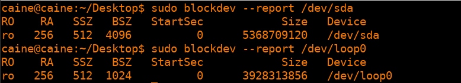
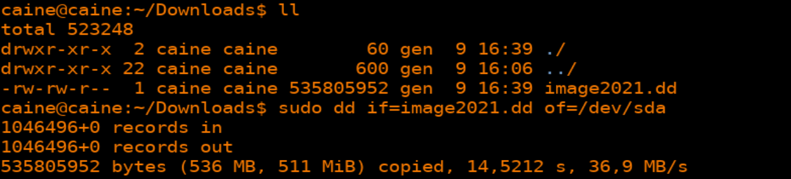
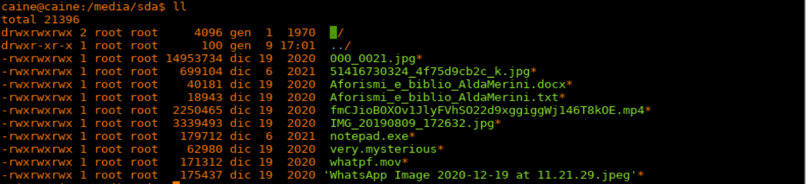
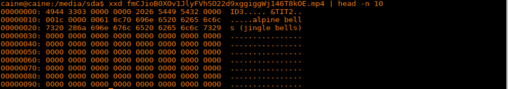
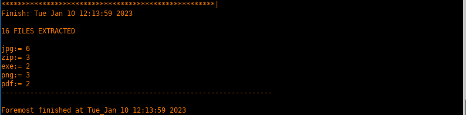

# LAB05 - Forensics Analysis

1. [Introduction](#introduction)
2. [CAINE](#caine)
    1. [Status of the virtual environment](#status-of-the-virtual-environment)
    2. [Acquisition of the image](#acquisition-of-the-image)
    3. [File identification](#file-identification)
    4. [File carving](#file-carving)
    5. [Data wiping](#data-wiping)

## Introduction
In this laboratory, we will perform exercises aimed to experiment with **forensic analysis**, specifically targeting analysis of the storage.

The opinion that deleting a file or history through a command like `rm` or dropping it in the trash bin will remove it completely from the hard disk drive is wrong. In reality, it only removes the file from the logical structures that address it, but the actual file remains on your computer until overwritten due to (future) requests of storage space from the OS and its applications.

Tools used in this laboratory are:
- `dd`: The `dd` command is a utility for copying data from one location to another. It is commonly used to copy data from a file to a device, or from a device to a file. It can also be used to copy data from one device to another, or to convert data from one format to another. The `dd` command is useful for creating backups of data, for transferring data between systems, and for performing other data manipulation tasks. It is a powerful command that can be used in a variety of different ways, but it is also potentially dangerous, as it can overwrite data if used incorrectly.
- `dcfldd`: the `dcfldd` command is an enhanced version of GNU `dd` with features useful for forensics and security. Based on the `dd` program found in the GNU Coreutils package. It has some additional features particularly suited for forensics analysis, like hashing-on-the-fly, flexible data-wipes and cloning verification.
- `exiftool`: the `exiftool` command is a command-line utility for reading, writing, and modifying the metadata of various types of files. It supports a wide range of file formats, including image, audio, and video files.
- `foremost`: it is a console program to recover files based on their headers, footers, and internal data structures. This process is commonly referred to as data carving. Foremost can work on image files, such as those generated by `dd`, Encase, etc, or directly on a drive.
- **PhotoRec**: **PhotoRec** is a file data recovery software designed to recover lost files including video, documents and archives from Hard Disks and CDRom and lost pictures (Photo Recovery) from digital camera memory. **PhotoRec** ignores the filesystem and goes after the underlying data, so it’ll work even if your media’s filesystem is severely damaged or formatted.
- `autopsy`: this tool will not be used in the laboratory, but merit a special mention due to its importance in the Digital Forensics field, since it enable the full workflow suitable for a Digital Forensic investigation. **Autopsy version 2** is a graphical interface to **The Sleuth Kit** and other open-source digital forensics tools. In many distributions (e.g. Kali, and many version of CAINE itself) is still available the version `2.24`. The `2.x` versions are a web-based interface, that despite being quite old, can be still pretty useful today. Autopsy 3 was a complete rewrite from Autopsy 2 to make it Java-based (not very widespread) In CAINE is present Autopsy version 4.x, In particular in CAINE 11.0, presently the last version of the distro, **Autopsy 4.13** is available. Autopsy 4.x improves on Autopsy 3 by supporting collaboration on a single case by multiple users. Autopsy is designed to be cross-platform (Windows, Linux, MacOS X - even if more testing has been devoted to Windows, according to the official documentation). Autopsy 4 is released under the Apache 2.0 license (while some libraries and tools may have different open source licenses).

## CAINE

All the results of the following sections come from the CAINE environment.

### Status of the virtual environment
In a Computer Forensics analysis, it is very important to avoid accidental modification of the evidence and data under analysis. To avoid data modification, almost all Linux-based recent distribution suitable for Computer Forensic uses a default read-only mounting of the present devices (this is true for CAINE and for Kali in `forensic mode`).

Linux environments allow multiple possibilities to investigate and manage file system structure. From a command-line tool perspective, a direct way to acquire info on devices and partition is the `fdisk` command-line tool, and information on its usage can be found through the command `man fdisk`.

As an example, to see the available device(s) the following command can be run: 
```sh
fdisk -l
```
whose output might look something like:
```sh
Disk /dev/sda: 256 GB, 256060514304 bytes
Disk /dev/sdb: 500 GB, 500107862016 bytes
```
This indicates that the system has two disk devices available: `/dev/sda` and `/dev/sdb`, with sizes of 256 GB and 500 GB, respectively.

We can also use the `fdisk -l` command to show information about specific devices. For example, to show information about the `/dev/sda` device, we can use the `fdisk -l /dev/sda` command.

By running the command on CAINE, we can see two devices:
- `/dev/loop0`: it s a **loop device**, which is a special type of file that acts like a block device (such as a hard drive). Loop devices can be used to mount files or file systems stored in regular files, allowing you to access the contents of the file as if it were a real disk. This can be useful for a variety of purposes, such as creating a bootable USB drive from an ISO image, or mounting a filesystem stored in a file for testing or recovery purposes.
- `/dev/sda`: it is a device file that represents a hard disk drive (HDD) or solid state drive (SSD) attached to the system. In Linux and other Unix-like operating systems, device files are used to access hardware devices such as hard drives, CD-ROM drives, and network interfaces.

We can check if the devices are in read-write or read-only state by using the `blockdev` command. Pay attention that the question is not if they are mounted in read-only or read-write mode (that could be investigated by using the `mount` command), but instead if the device is in read-only or read-write state. The result is the following:

<p align="center">
    
</p>

### Acquisition of the image
A very common task in a Computer Forensics analysis is the **acquisition of part of a storage/hard disk in order to perform deep analysis**. In Linux environment two main possible option exists: 
- to acquire a physical storage, physically integrate it, and see it as a device to connect to the file system (e.g. by mounting them) 
- the original storage can be deposited in a single file that contains the whole content and file system structure inside (using tools like dd and the forensics counterparts).

In case a file containing a valid file system is available, a possibility to investigate it is by using a functionality to mount these images files as valid block devices. Many Forensics Linux distribution provides some GUI interfaces to do that (like Disk Image Mounter for CAINE). Those commands use the `loop` interface for devices. Loop devices are artifacts that allow access to a file in the same way of accessing to a block device. This is achieved by introducing a pseudo-block device (the `loop` one) as intermediary to access to the original file. At OS level, the operations (`read`, `write`, ...) to the mounted directory will be re-directed versus the `loop` device, which will transparently translate the requests into operation to the original file. When the `loop` device is already enabled (like in CAINE and Kali) it can be directly used through the `mount` command:
```sh
mount -o loop image.dd <mounting_directory>
```

where mounting directory must be an existent directory (e.g. `/media/imagedd`). Note that if we run `fdisk -l` before and after the mount command, you may appreciate the presence of a new `/dev/loop` device, which is the interface between `image.dd` and the mounting directory.

The image can be found in [here](./src/image2021.dd).

Now, having the image, we can either mount it through the `/dev/loop0` device or clone (with the `dd` utility) it to the `/dev/sda` and then mount it directly from here.

Following the second case, we can use the command
```sh
dd if=image2021.dd of=/dev/sda
```
to clone the image to the specified device. Then, in order to check if the cloning has been performed correctly, we can run a `md5sum` on both the image and the `/dev/sda` file and see if they are the same.

<p align="center">
    
</p>


Now, we can try to mount the freshly created device. CAINE inserts in the `/etc/fstab` an entry that maps devices in the `/dev` to a corresponding directory in `/media` (e.g. `/dev/sda1` is mapped on `/media/sda1`), so we can just use a command like:
```sh
mount /media/sda
```

whose result is the following:
<p align="center">
    
</p>


### File identification

Now that our environment is ready and we have acquired the data to be analyzed, it is time to start the analysis phase, by moving into the mounted directory and having a look at the content.

By using specific commands to analyze meta-data like `exiftool`, we can walk through all the files and perform the following tasks:
- identify the file type;
- annotate interesting data about each file (e.g. creation date, last modification);
- note down any suspect detail that we encountered.

Most of the known file formats can be identified by the few starting (and sometimes ending) bytes. A comprehensive list of file signature is publicly available [here](https://en.wikipedia.org/wiki/List_of_file_signatures).

As an example, the `.mp4` file, if analyzed with a hex viewer (such as `xxd`), shows the following bytes:

<p align="center">
    
</p>

As it can be seen from the previous link, the `49 44 33` bytes corresponds to a MP3 file with an ID3v2 container.

However, the command line utility `file` automatically performs the check against the signature, so it can be used to perform the check that has been performed at hand in the previous point thanks to the hex viewer. 

As an example: 
- `notepad.exe` is actually a `PE32 executable (GUI) Intel 80386, for MS Windows`;
- `very.mysterious` is actually a `pcap-ng capture file - version 1.0`. In particular, by running `strings` on it, it is possible to see that the file was created by `Dumpcap (Wireshark) 2.6.10`. Moreover, by stringing the file, we can see that the author hid some secrets there: `myPassIsEvilAndSmartttttt` and others!
- `whatpg.mov` is actually a `PDF document, version 1.4`.

### File carving
What about the invisible content (i.e. deleted files)?

Deleted files can be a very rich source of information, but to recover them the file system structure have to be partially or totally bypassed (e.g. do not rely on allocation table). CAINE provides tools that do not rely on the file system structures to identify information, like `foremost`.

The process of extracting data from a device or disk image is named **carving**, meaning that the data comes out from a non-shaped image like sculptures from the stone (in this case the “sculptures” assume the form of, for example, .jpeg, .png, .zip, .pdf, files). We will instruct `foremost` to carve how many files as it can with the following command:
```sh
foremost -t all -i <virtual_device> -o <recovery_directory> -v
```

where:
- `-t` set the file types to carve out, `all` means any supported file by `foremost`;
- `-i` is specifying the input, which can be an image file or a device;
- `-o` is the output directory, where the carved result will be placed. Inside the recovery directory `foremost` will create a set of directory for each file type will be able to recover;
- `-v` log all the messages to an audit report (inside the recovery directory) instead of standard output).

<p align="center">
    
</p>

The result can be found in [recovered_foremost](./src/recovered_foremost/).

Another powerful tool for data carving present in many CF distribution (like CAINE and Kali) is `photorec`. To execute it at best, some previous knowledge on the target of examination is expected, e.g. the file system type. Since we already posses all required info from previous steps of this lab, we can execute the following command:
```sh
photorec /dev/sda
```
The result can be found in [recovered_photorec](./src/recovered_photorec/).

### Data wiping
To begin a new investigation, the testbed should be left perfectly clean to avoid pollution of the evidences of the next case.

To remove any trace of the evidence on the virtual device used so far, the command `dcfldd` can be used again. In this case, to perform data wiping. It allows overwriting every byte of the target device with a specific pattern. A sequence of zeros will perfectly accomplish the goal:
```sh
dcfldd pattern=00 of=virtual device
```


