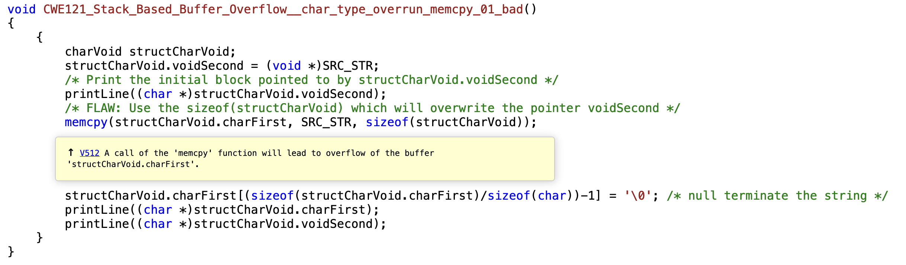
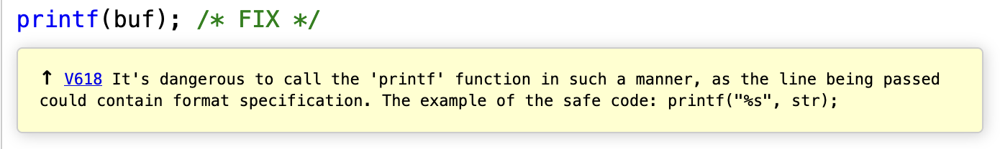
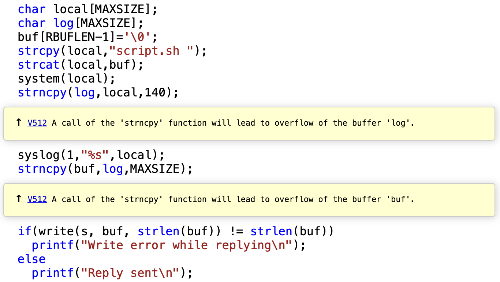

# LAB 04 - Static Analysis of C Source Code

1. [Introduction](#introduction)
    1. [Getting started with flawfinder](#getting-started-with-flawfinder)
2. [Static Analysis](#static-analysis)
    1. [Analyzing simple examples](#analyzing-simple-examples)
        1. [`test1.c` analysis](#analysis-of-test1c)
        2. [`test2.c` analysis](#analysis-of-test2c)
        3. [`test3.c` analysis](#analysis-of-test3c)
    2. [Analyzing CVE-2017-1000249](#cve-2017-1000249)

## Introduction
The purpose of this lab is to make experience with static source code analysis tools for the C/C++ languages. More specifically, two tools will be experimented: a simple lexical scanner (**flawfinder**) and a more sophisti-ated commercial static analysis tool (**PVS-Studio**). As the two tools have not only different features but also different coverage of vulnerabilities, their combined use is recommended.

Through all the lab, all the results of the tools will be stored in the `Results` folder.

### Getting started with flawfinder
Inside the `Introduction` folder, we can find the `CWE121.c` file which will be analyzed with the flawfinder tool.  To run it:
```bash
flawfinder CWE121.c
```
The result of the analysis tells us how many possible security warnings have been found in the source code and what they are based on CWEs. The result is the following:
```bash
# other information

FINAL RESULTS:

../Introduction/CWE121/CWE121.c:85:  [3] (random) srand:
  This function is not sufficiently random for security-related functions
  such as key and nonce creation (CWE-327). Use a more secure technique for
  acquiring random values.
../Introduction/CWE121/CWE121.c:27:  [2] (buffer) char:
  Statically-sized arrays can be improperly restricted, leading to potential
  overflows or other issues (CWE-119!/CWE-120). Perform bounds checking, use
  functions that limit length, or ensure that the size is larger than the
  maximum possible length.
../Introduction/CWE121/CWE121.c:42:  [2] (buffer) memcpy:
  Does not check for buffer overflows when copying to destination (CWE-120).
  Make sure destination can always hold the source data.

ANALYSIS SUMMARY:

Hits = 3

# other information
```

### Getting started with PVS-Studio
As we use PVS-Studio from the command line, some bash scripts are provided to simplify running PVS-Studio. They can be found in the `bin` directory of this repository.
- `pvs-clean` remove all the outputs generated by PVS-Studio, cleaning the current directory.
- `pvs-addcomment` adds comments to the `.c` file in order to be used with the free version of PVS-Studio.
- `pvs-setlicense` set PVS-Studio to work with the free license enabled.
- `pvs-run` can be used to run PVS-Studio. You must run it with the same command-line arguments that you use for the `make` command when you compile the program. The report is generated in HTML format (in the `htmlreport` directory). If you want to change the options used to run PVS-Studio you can edit the `pvs-run` script.

In order to analyze the `CWE121.c` source code, we need to firstly run the `pvs-addcomment` command and then produce a report with the `pvs-run` utility. It will generate a `htmlreport` that can be accessed through the browser and it will display the vulnerabilities founded:


## Static Analysis
In this section we will analyze different C files in order to find and fix vulnerabilities.

All the files can be found in the `Analysis` folder.
All the results can be found in the `Results` folder.

### Analyzing simple examples
Use Flawfinder and PVS-Studio to analyze the simple examples:
- `test1`
- `test2`
- `test3`

Then, analyze each reported problem and decide if it is a true positive or a false positive (also, provide an explanation of your decision). At the end, sort the true positives by severity and explain the reasons for your decisions.

#### Analysis of test1.c
The `test1.c` is a vulnerable C source code which contains an exploitable `printf()`. The source code is the following:
```C
#include <stdio.h>
#include <string.h>

int main(int argc, char **argv) {

    char buf[5012];

    strncpy(buf, argv[1], sizeof buf - 1);
    buf[sizeof buf - 1] = 0;

    printf(buf); /* FIX */

    return (0);

}
```

By running `flawfinder`, we can see the following result:
```
FINAL RESULTS:

test1.c:28:  [4] (format) printf:
  If format strings can be influenced by an attacker, they can be exploited (CWE-134). Use a constant for the format specification.

test1.c:23:  [2] (buffer) char:
  Statically-sized arrays can be improperly restricted, leading to potential overflows or other issues (CWE-119!/CWE-120). Perform bounds checking, use functions that limit length, or ensure that the size is larger than the maximum possible length.

test1.c:25:  [1] (buffer) strncpy:
  Easily used incorrectly; doesn't always \0-terminate or check for invalid pointers [MS-banned] (CWE-120).
```

On the other hand, the PVS-Studio report shows the following vulnerability:


Let's analyze the results obtained.

- The first vulnerability found by `flawfinder` is actually the same found by PVS-Studio. It has a severity level of `[4]`, which make it highly probable that it is not a false positive. Indeed, it refers to a possible **format strings** attack, performed on the `printf(buf)`. PVS-Studio reminds us that is it safer to use `printf("%s", buf)`.
- The second vulnerability, with severity `[2]`, is just a warning of a possible **buffer overflow**. However, in the `test1.c` code it is possible to see that this case is taken into account by using `strncpy(buf, argv[1], sizeof buf - 1)`. This is a **false positive**.
- The third vulnerability, with severity `[1]` refers to a possible non termination buffer pointer. However, in the source code, the termination is explicitly added: `buf[sizeof buf - 1] = 0;`. Again, this is a **false positive**.


#### Analysis of test2.c
The `test2.c` is a vulnerable C file whose source code is the following:
```C
#include <stdio.h>
#include <netdb.h>
#include <netinet/in.h>
#include <stdlib.h>
#include <string.h>
#include <sys/socket.h>
#include <sys/types.h>
#include <inttypes.h>
#include <unistd.h>
#include <ctype.h>
#include <syslog.h>

#define RBUFLEN		128
#define	MAXSIZE		138

/* GLOBAL VARIABLES */
char buf[RBUFLEN];		 /* reception buffer */

/* Provides service on the passed socket */
void service(int s)
{
    int	 n;

    for (;;)
    {
        n=read(s, buf, RBUFLEN-1);
        if (n < 0)
        {
            printf("Read error\n");
            close(s);
            printf("Socket %d closed\n", s);
            break;
        }
        else if (n==0)
        {
            printf("Connection closed by party on socket %d\n",s);
            close(s);
            break;
        }
        else
        {
            char local[MAXSIZE];
            char log[MAXSIZE];
            buf[RBUFLEN-1]='\0';
            strcpy(local,"script.sh ");
            strcat(local,buf);
            system(local);
            strncpy(log,local,140);
            syslog(1,"%s",local);
            strncpy(buf,log,MAXSIZE);
            if(write(s, buf, strlen(buf)) != strlen(buf))
              printf("Write error while replying\n");
            else
              printf("Reply sent\n");
        }
    }
}
```

By running `flawfinder`, we can see the following result:
```
FINAL RESULTS:

test2.c:46:  [4] (buffer) strcat:
  Does not check for buffer overflows when concatenating to destination [MS-banned] (CWE-120). Consider using strcat_s, strncat, strlcat, or snprintf (warning: strncat is easily misused).

test2.c:47:  [4] (shell) system:
  This causes a new program to execute and is difficult to use safely (CWE-78). try using a library call that implements the same functionality if available.

test2.c:17:  [2] (buffer) char:
  Statically-sized arrays can be improperly restricted, leading to potential overflows or other issues (CWE-119!/CWE-120). Perform bounds checking, use functions that limit length, or ensure that the size is larger than the maximum possible length.

test2.c:42:  [2] (buffer) char:
  Statically-sized arrays can be improperly restricted, leading to potential overflows or other issues (CWE-119!/CWE-120). Perform bounds checking, use functions that limit length, or ensure that the size is larger than the maximum possible length.

test2.c:43:  [2] (buffer) char:
  Statically-sized arrays can be improperly restricted, leading to potential overflows or other issues (CWE-119!/CWE-120). Perform bounds checking, use functions that limit length, or ensure that the size is larger than the maximum possible length.

test2.c:45:  [2] (buffer) strcpy:
  Does not check for buffer overflows when copying to destination [MS-banned] (CWE-120). Consider using snprintf, strcpy_s, or strlcpy (warning: strncpy easily misused). Risk is low because the source is a constant string.

test2.c:26:  [1] (buffer) read:
  Check buffer boundaries if used in a loop including recursive loops (CWE-120, CWE-20).

test2.c:48:  [1] (buffer) strncpy:
  Easily used incorrectly; doesn't always \0-terminate or check for invalid pointers [MS-banned] (CWE-120).

test2.c:50:  [1] (buffer) strncpy:
  Easily used incorrectly; doesn't always \0-terminate or check for invalid pointers [MS-banned] (CWE-120).

test2.c:51:  [1] (buffer) strlen:
  Does not handle strings that are not \0-terminated; if given one it may perform an over-read (it could cause a crash if unprotected) (CWE-126).

test2.c:51:  [1] (buffer) strlen:
  Does not handle strings that are not \0-terminated; if given one it may perform an over-read (it could cause a crash if unprotected) (CWE-126).
```
On the other hand, the PVS-Studio report shows the following vulnerability:


Let's analyze the results obtained.

- The first vulnerability found by `flawfinder` has a severity level of `[4]`, which make it highly probable that it is not a false positive. It refers to a possible **buffer overflow** attack, performed on the `strcat()` routine. It is suggested to use the safer `strncat()`.
- The second vulnerability, again with severity `[4]`, is telling us that the `system()` routine can be exploited to have RCE on the machine. However, this is not the case since the source of the `local` variable is a hard-coded string referring to a (supposedly) file on the machine. If the attacker does not have access to the machine, this is a **false positive**.
- The other vulnerabilities have a low severity risk, less than `[2]` which may be intended as a higher risk of false positives. However, PVS-Studio shows that `strncpy()` at lines `:48` and `:50` can be misused if the final termination bytes (`\0`) is not taken into account. Indeed, this is the case. 


#### Analysis of test3.c
The `test3.c` is a vulnerable C file whose source code is the following:
```C
#include "std_testcase.h"

#ifdef _WIN32
#include <winsock2.h>
#include <windows.h>
#include <direct.h>
#pragma comment(lib, "ws2_32") /* include ws2_32.lib when linking */
#define CLOSE_SOCKET closesocket
#else /* NOT _WIN32 */
#include <sys/types.h>
#include <sys/socket.h>
#include <netinet/in.h>
#include <arpa/inet.h>
#include <unistd.h>
#define INVALID_SOCKET -1
#define SOCKET_ERROR -1
#define CLOSE_SOCKET close
#define SOCKET int
#endif

#define TCP_PORT 27015
#define IP_ADDRESS "127.0.0.1"
#define CHAR_ARRAY_SIZE (3 * sizeof(data) + 2)

void CWE122_Heap_Based_Buffer_Overflow__c_CWE129_connect_socket_02_bad()
{
    int data;
    /* Initialize data */
    data = -1;
#ifdef _WIN32
            WSADATA wsaData;
            int wsaDataInit = 0;
#endif
            int recvResult;
            struct sockaddr_in service;
            SOCKET connectSocket = INVALID_SOCKET;
            char inputBuffer[CHAR_ARRAY_SIZE];
            do
            {
#ifdef _WIN32
                if (WSAStartup(MAKEWORD(2,2), &wsaData) != NO_ERROR)
                {
                    break;
                }
                wsaDataInit = 1;
#endif
                /* POTENTIAL FLAW: Read data using a socket */
                connectSocket = socket(AF_INET, SOCK_STREAM, IPPROTO_TCP);
                if (connectSocket == INVALID_SOCKET)
                {
                    break;
                }
                memset(&service, 0, sizeof(service));
                service.sin_family = AF_INET;
                service.sin_addr.s_addr = inet_addr(IP_ADDRESS);
                service.sin_port = htons(TCP_PORT);
                if (connect(connectSocket, (struct sockaddr*)&service, sizeof(service)) == SOCKET_ERROR)
                {
                    break;
                }
                /* Abort on error or the connection was closed, make sure to leave
                space to append terminator */
                recvResult = recv(connectSocket, inputBuffer, CHAR_ARRAY_SIZE - 1, 0);
                if (recvResult == SOCKET_ERROR || recvResult == 0)
                {
                    break;
                }
                /* NUL-terminate the string */
                inputBuffer[recvResult] = '\0';
                /* Convert to int */
                data = atoi(inputBuffer);
            }
            while (0);
            if (connectSocket != INVALID_SOCKET)
            {
                CLOSE_SOCKET(connectSocket);
            }
#ifdef _WIN32
            if (wsaDataInit)
            {
                WSACleanup();
            }
#endif
        {
            int i;
            int * buffer = (int *)malloc(10 * sizeof(int));
            if (buffer == NULL) {exit(-1);}
            /* initialize buffer */
            for (i = 0; i < 10; i++)
            {
                buffer[i] = 0;
            }
            if (data >= 0)
            {
                buffer[data] = 1;
                /* Print the array values */
                for(i = 0; i < 10; i++)
                {
                    printIntLine(buffer[i]);
                }
            }
            else
            {
                printLine("ERROR: Array index is negative.");
            }
            free(buffer);
        }
}


```


By running `flawfinder`, we can see the following result:
```
FINAL RESULTS:

test3.c:37:  [2] (buffer) char:
  Statically-sized arrays can be improperly restricted, leading to potential overflows or other issues (CWE-119!/CWE-120). Perform bounds checking, use functions that limit length, or ensure that the size is larger than the maximum possible length.
  
test3.c:71:  [2] (integer) atoi:
  Unless checked, the resulting number can exceed the expected range (CWE-190). If source untrusted, check both minimum and maximum, even if the input had no minus sign (large numbers can roll over into negative number; consider saving to an unsigned value if that is intended).
```

On the other hand, PVS-Studio did not fund any vulnerabilities. Indeed, all the flaws found by `flawfinder` are **false positive**, which can be ignored.

### CVE-2017-1000249
**CVE-2017-1000249** refers to a buffer overflow vulnerability that was found in an implementation of the UNIX `file()` command. In this exercise we try to find a vulnerability is a real application code. In this folder, there is a PDF document with the CVE description of the vulnerability and the package with the sources of a version of the software affected by the vulnerability. 

Running `flawfinder` on the vulnerable file (`readelf.c`) produces 18 possible vulnerabilities, which I will not report here. However, the classification in **True Positives** (**TP**) and **False Positive** (**FP**) is the following:
|Vulnerability| True Positive (TP) | False Positive (FP) |
|:---:|:---:|:---:|
|`readelf.c:81: [2] (buffer) char`|/|**Yes** <br> Statically-sized arrays can be improperly restricted, leading to potential overflows or other issues.  |
|`readelf.c:100: [2] (buffer) char`|/|**Yes** <br> Statically-sized arrays can be improperly restricted, leading to potential overflows or other issues.  |
|`readelf.c:121: [2] (buffer) char`|/|**Yes** <br> Statically-sized arrays can be improperly restricted, leading to potential overflows or other issues.  |
|`readelf.c:333: [2] (buffer) char`|/|**Yes** <br> Statically-sized arrays can be improperly restricted, leading to potential overflows or other issues.  |
|`readelf.c:535:  [2] (buffer) memcpy`|**Yes** <br> Problem is that, even if the statement on the size of the buffer is checked, it is checked wrongly: `descsz >= 4 \|\| descsz <= 20`. This leads to arbitrary values of `descsz`| / |
|`readelf.c:720: [2] (buffer) char`|/|**Yes** <br> Statically-sized arrays can be improperly restricted, leading to potential overflows or other issues.  |
|`readelf.c:723:  [2] (buffer) memcpy`|**Yes** <br> Does not check for buffer overflows when copying to destination. | / |
|`readelf.c:954:  [2] (buffer) memcpy`|**Yes** <br> Does not check for buffer overflows when copying to destination. | / |
|`readelf.c:996: [2] (buffer) char`|/|**Yes** <br> Statically-sized arrays can be improperly restricted, leading to potential overflows or other issues.  |
|`readelf.c:1040:  [2] (buffer) memcpy`|**Yes** <br> Does not check for buffer overflows when copying to destination. | / |
|`readelf.c:1214: [2] (buffer) char`|/|**Yes** <br> Statically-sized arrays can be improperly restricted, leading to potential overflows or other issues.  |
|`readelf.c:1327: [2] (buffer) char`|/|**Yes** <br> Statically-sized arrays can be improperly restricted, leading to potential overflows or other issues.  |
|`readelf.c:1336:  [2] (buffer) memcpy`|**Yes** <br> Does not check for buffer overflows when copying to destination. | / |
|`readelf.c:1477: [2] (buffer) char`|/|**Yes** <br> Statically-sized arrays can be improperly restricted, leading to potential overflows or other issues.  |
|`readelf.c:1478: [2] (buffer) char`|/|**Yes** <br> Statically-sized arrays can be improperly restricted, leading to potential overflows or other issues.  |
|`readelf.c:1578: [2] (buffer) char`|/|**Yes** <br> Statically-sized arrays can be improperly restricted, leading to potential overflows or other issues.  |
|`readelf.c:1331:  [1] (buffer) read`|/|**Yes** <br> Check buffer boundaries if used in a loop including recursive loops.  |
|`readelf.c:1350:  [1] (buffer) strlen`| **Yes** <br>  Does not handle strings that are not `\0`-terminated; if given one it may perform an over-read. |/|

